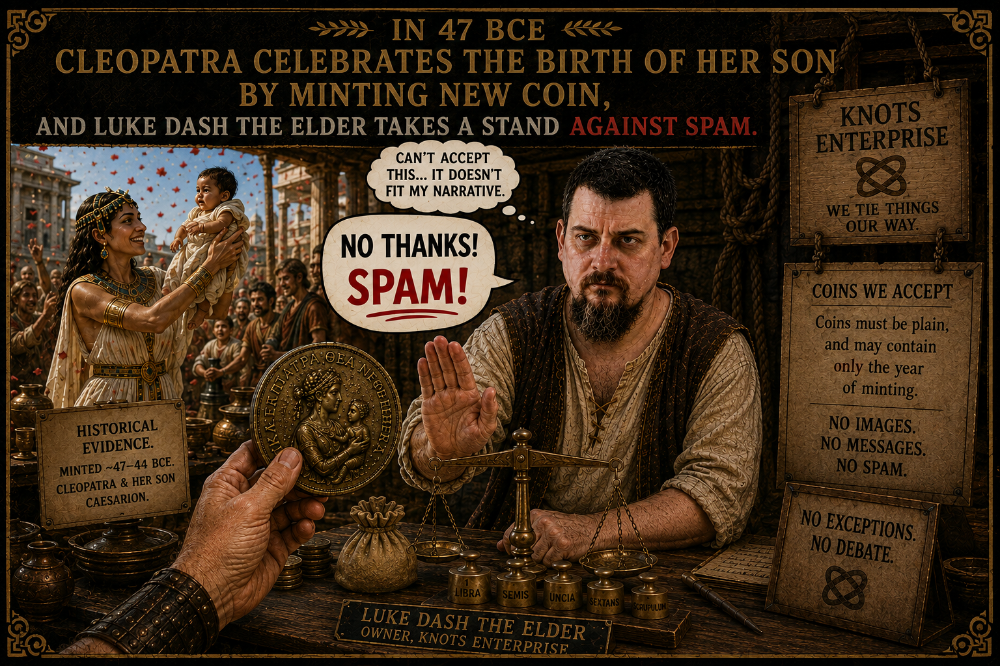

# What is spam?

BIP-110 rests on a deceptively simple premise: Bitcoin is "permissionless as money, not as data storage." The proposal treats this distinction as self-evident. But is it?

## Money has never been "just money"

When Cleopatra minted coins bearing her portrait and that of her newborn son Caesarion around 47 BCE, she was not performing a monetary act and a data act separately. The message *was* the money. The coin's authority, its identity, its political statement — all were inseparable from its function as a medium of exchange.

This was not an exception. It was the rule. For as long as money has existed, its issuers and users have embedded non-monetary information in it:

- Ancient rulers stamped coins with portraits, titles, and religious symbols — we know some kings *only* because their coins survived.
- Every banknote in circulation today carries national symbols, portraits, serial numbers, and security features that are "data," not "money."
- Modern payment systems routinely carry user messages — invoice references, memo fields, remittance information. SWIFT MT103 messages contain up to 4x35 characters of free-text sender-to-receiver information. This is not a bug; it is a feature.

## Bitcoin is no exception

Satoshi embedded a newspaper headline in the genesis block. OP_RETURN has existed since 2014. Timestamping protocols, coloured coins, and commitment schemes have used Bitcoin's data-carrying capacity for over a decade.

The question that BIP-110 asks — "what is spam?" — has no clean answer, because the boundary between monetary data and non-monetary data has never been clean. A coin bearing Cleopatra's face is data. A transaction tagging an invoice number is data. The genesis block's embedded headline is data. If these are not spam, then "spam" cannot simply mean "non-monetary data on the blockchain."

## Restriction does not work

Even on its own terms, BIP-110's approach fails. The proposal acknowledges that data can be spread across multiple fields to circumvent size limits, but dismisses this as costly and obfuscated. In practice, the cost of circumvention is trivial. Alternative embedding techniques already exist, and the Ordinals project itself has a pull request ready to merge that routes around the proposed restrictions.

This is not a theoretical concern — it is an arms race that BIP-110 cannot win. Every restriction invites a workaround. Every workaround invites a tighter restriction. The end state is a protocol encrusted with ad-hoc rules that burden legitimate users while failing to stop determined data embedders. This is the same pattern that made firewall-based internet censorship a losing strategy: you can make it inconvenient, but you cannot make it impossible, and the collateral damage to legitimate use grows with each round.

If data embedding cannot be prevented — and BIP-110's own rationale concedes that it cannot — then the question is not how to ban it, but how to accommodate it in a way that minimises harm to the network.

## The right question

The productive question is not *whether* Bitcoin should carry user data — it always has, from block zero. And it is not *whether* messaging should be part of money — it always has been, from the first coin struck with a king's face.

The question is *who gets to do it*. Throughout history, the ability to embed messages in money has been a privilege of the powerful: sovereigns, central banks, card networks. Satoshi demonstrated that Bitcoin could be different when he inscribed a headline into the genesis block — not as a ruler asserting authority, but as an individual leaving a mark.

BIP-110 would close that door. It would preserve the coinbase — where miners can still embed data — while restricting the tools available to ordinary users. In effect, it re-establishes the old rule: those who mint may message; those who transact may not.

The real question is whether we extend the ancient privilege of messaging-with-money to all users, and if so, how we do it responsibly — how to price it fairly, how to minimise the burden on node operators, and how to prevent it from crowding out monetary transactions.

That is an engineering problem, not a moral one. And it has an engineering answer.
