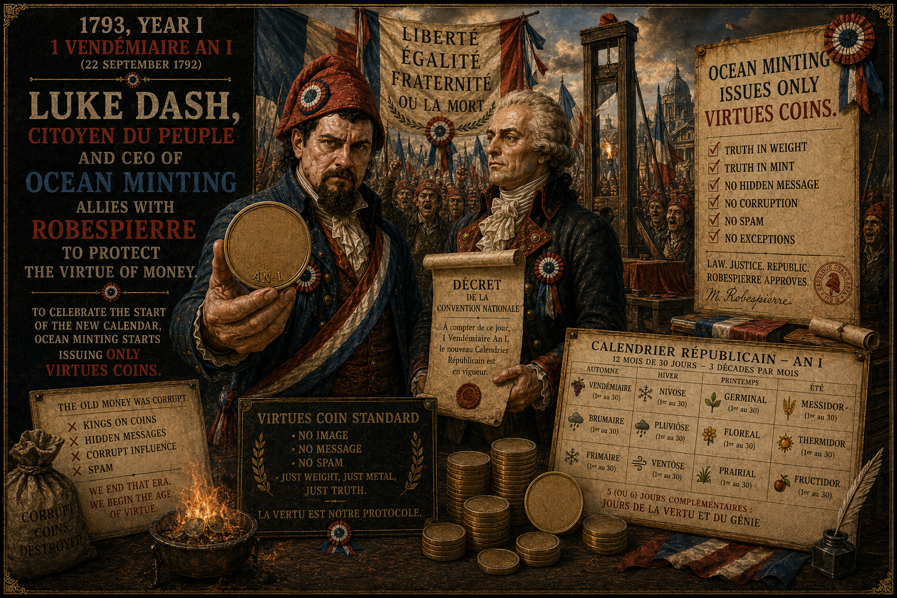

# Should Bitcoin be virtuous?

There is a premise running through the BIP-110 debate that rarely gets examined directly: the idea that Bitcoin should be *virtuous* — that the protocol itself should resist use cases that some participants find objectionable.

This premise deserves scrutiny, because it has been tried before. And the results were not good.

## The neutrality of money

Successful money has always served the wicked and the virtuous alike. This is not a defect — it is the defining property that makes money *money*. The moment a medium of exchange starts discriminating based on the moral character of its users or the content of their transactions, it ceases to be neutral and becomes a tool of control.

This is, in fact, one of Bitcoin's original promises. Traditional financial systems have been increasingly weaponised to enforce subjective notions of virtue: sanctions regimes, debanking campaigns, payment processor censorship. Bitcoin was designed as an alternative — money that works the same way for everyone, regardless of who approves of them or their purposes.

BIP-110 would introduce, for the first time at the consensus level, the principle that some *uses* of Bitcoin are illegitimate — not because they are technically harmful to the network, but because they do not align with what the proposal's authors consider Bitcoin's proper purpose. Once that principle is established, the question is no longer *whether* Bitcoin enforces virtue, but *whose* virtue it enforces.

## The Jacobin precedent

In 1793, Maximilien Robespierre and the Jacobin Club set out to build a Republic of Virtue. They began with ideals that many shared — liberty, equality, fraternity. But virtue, once made mandatory, requires enforcement. And enforcement requires identifying the insufficiently virtuous.

The Committee of Public Safety did not set out to create the Terror. It set out to protect the Revolution from its enemies. But the definition of "enemy" expanded with each passing month. First it was royalists. Then moderates. Then anyone who questioned the Committee's methods. Dissent became evidence of counter-revolutionary sentiment. The accusation and the verdict became the same thing.

The BIP-110 discourse follows a recognisable pattern. The proposal defines a category of "abuse" and positions itself as the defence against it. Those who question whether the restriction is wise, or whether the distinction between "monetary" and "non-monetary" data is coherent, risk being cast as defenders of spam — or worse, as people who do not understand Bitcoin's true purpose.

This is not a slippery slope argument. It is a description of what is already happening.

## Signs of virtue, not vice

Consider two things that BIP-110 proponents point to as evidence of Bitcoin's corruption:

**Ordinals.** The inscription of images and data onto Bitcoin — the primary target of BIP-110 — is treated as an attack on the network. But step back and look at what actually happened: people found Bitcoin's block space so valuable, so durable, so censorship-resistant that they were willing to pay market-rate fees to store cultural artefacts on it. They did this not because Bitcoin was broken, but because it worked. Ordinals are not a sign that Bitcoin has been hijacked. They are a sign that Bitcoin is the most trusted ledger in human history — so trusted that people want to put things on it beyond payments. That is a compliment, not an attack.

**Iran and the Strait of Hormuz.** Iran, cut off from SWIFT and the Western banking system by sanctions, has turned to Bitcoin to collect transit fees from vessels passing through the Strait of Hormuz — one of the world's most critical shipping lanes. To the sanctions enforcer, this is evasion. To the Bitcoiner, this is the entire point. A sovereign nation, excluded from the financial system by a rival power, found that Bitcoin's permissionless nature allowed it to continue participating in global trade. This is not Bitcoin failing. This is Bitcoin succeeding at exactly what it promised: money that no single authority can censor.

Both examples are uncomfortable for people who want Bitcoin to serve only uses they approve of. But that discomfort is the price of neutrality. A system that is truly permissionless will inevitably be used by people and for purposes that some participants find objectionable. If it could not be, it would not be permissionless — it would just be another system with gatekeepers.

## Virtue is always subjective

BIP-110's authors are sincere in their belief that restricting data storage protects Bitcoin. But sincerity is not a safeguard. Robespierre was sincere too. The problem is not the intentions of the people defining virtue — it is the act of encoding subjective moral judgements into systems that are supposed to be neutral.

Bitcoin's value proposition rests on its neutrality: fixed rules, applied equally, with no authority empowered to decide which transactions are worthy and which are not. A protocol that rejects "unsupported use cases" by consensus is a protocol that has appointed itself as arbiter of legitimate use. Today it is data storage. Tomorrow it could be anything that the next Committee of Public Safety finds objectionable.

The right path is not to make Bitcoin virtuous. It is to make Bitcoin *neutral* — and to solve the legitimate engineering problems (node storage costs, fee market distortions) with engineering solutions that do not require anyone to define what virtue is.
